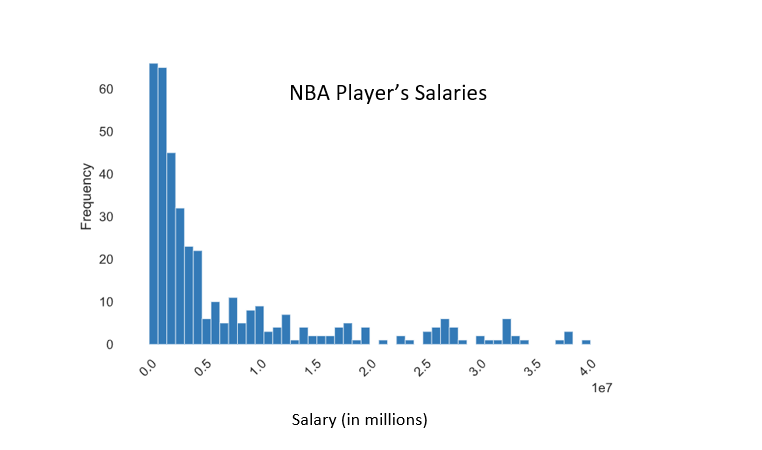

# NBA Salary Prediction
Question: \
Out of different machine learning models, which model most accurately predicts an NBA Player's salary? With the top model, what are the top five features that contribute most to this prediction? 

Finding the data:  
The data is found on two different websites- \
https://hoopshype.com/salaries/players/2019-2020/ \
https://www.basketball-reference.com/leagues/NBA_2020_per_game.html \
The first website shows salaries for each NBA player during the 2019-2020 season. 
The second website shows many different features such as the player's position, team, average minutes played in a game, average three pointers, age, etc. There are a total of 31 features that are used. 
The data is read in to the file by using the read_html function in pandas. 

Cleaning the data: \
Looking at the data with how it is read in, there is some cleaning that needs to be done. 
1) Some extra lines were read in from the websites and need to be deleted 
2) There are some duplicate players (ones that switched teams during the season). These players will all be deleted because their salaries by team are messed up and they are "outlier" players
3) Drop the extra columns from the first website (salary) so the dataframe only contains two columns ('Player' and '2019/20')
4) Merge the two dataframes together on Player (there should be a length of 386)
5) In the '2019/20' column, delete the '$' and ',' so that the data can be read correctly
6) Many of the features were read in as non-numerical. To fix this, change all features (except player, team, and position) to floats
7) There are a few columns with missing data (the percentages columns). Fill in the missing data with zeroes. 
8) Delete the 'RK' and 'Player' features - RK is only based on how the data was sorted and read in and Player will not be useful in the model

Building different machine learning models: 
1) Encode the data using the get_dummies from pandas for "Pos" (Position) and "Tm" (Team). These are both categorical variables.
2) Split the data using a train and test dataset
3) Try different machine learning models to find the model for best prediction (some options are: Decision Tree, Random Forest, SVR, Extra Trees, Lasso, Ridge, Elastic Net)
4) Run a Grid Search to find the best parameters for each model 
5) Get feature importances and find the top five most important features for the model. Graph these features. 

Results: \
The Decision Tree model ended up being the most accurate model. It was able to predict an NBA Player's salary with a mean absolute error of $2,215,576. While running the feature importances, the top five features that contribute most to this prediction are points scored by player (per game), player's age, free throws attempted (per game), minutes played (per game) and two point field goals attempted (per game). 

Potential sources of bias: \
There are many potential sources of bias. One is that there could be players who received contracts but then got injured so they didn't play any games. They could have a high salary but zero stats and that could change the model. Another source of bias could be the distribution of salaries. About 3/5 of players receive less that $5,000,000 and the top players receiving $40,000,000. This causes the data to be extremely right skewed. This makes it difficult to predict the salary when the data is not normally distributed. 
#

Figure 1

